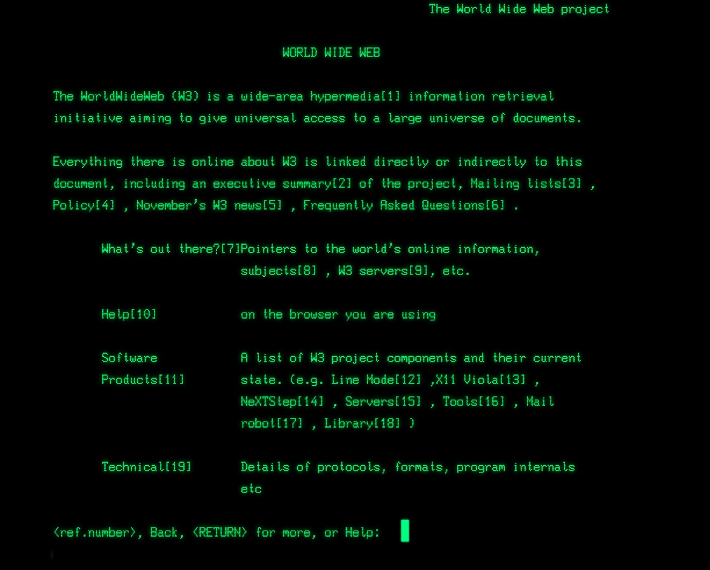
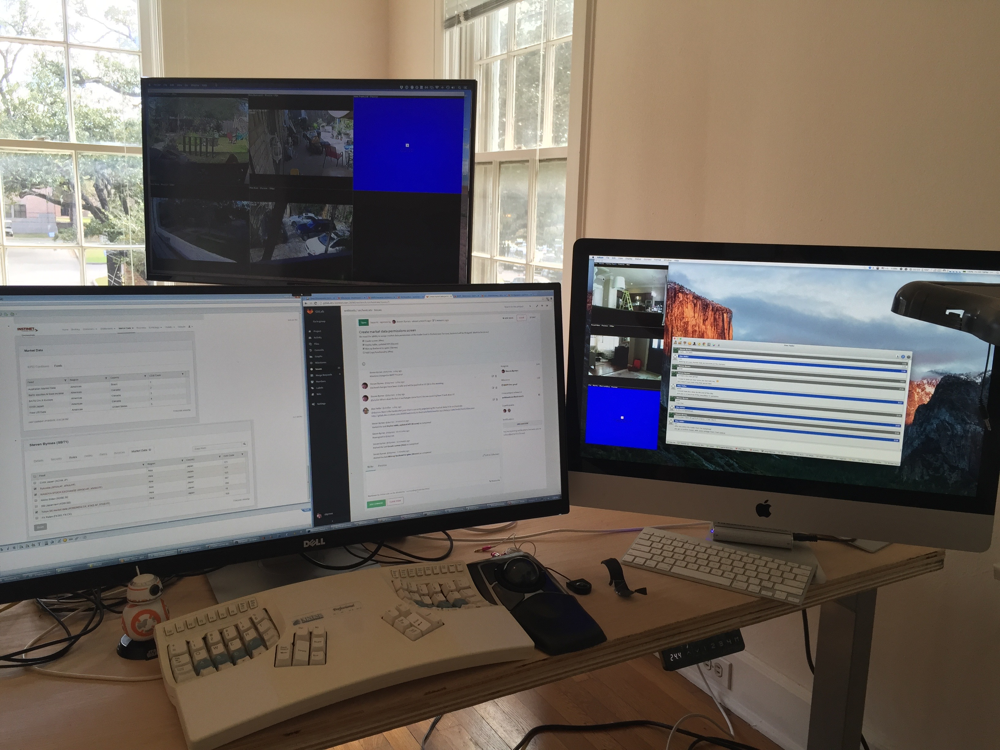

% Programming
% Steven Byrnes
% December 12, 2016

## My Journey

<aside class="notes">

Really wasn't sure what to talk about, so I'll just go over how and
when I started, what I've been up to in more recent years, and some
times for questions hopefully.

</aside>

# Backstory

## In the beginning

<aside class="notes">

So we'll start with everybody's favorite subject... history.

Started around 4th or 5th grade in school.

</aside>

## Turtle graphics

<aside class="notes">

LOGO programming language.  Seymour Papert.  Physical turtle.

</aside>

## VIC20

<aside class="notes">

Parents got first computer around 1981 (5th grade).  5k of RAM.  3.5k
usable.  (In comparison, a typical PC these days has about 1M times as
much memory, and this laptop has 2 million times as much memory.)

Used casette for data.

Wrote programs in BASIC.

</aside>

## First PC (clone)

<aside class="notes">

1984.  Running DOS. Windows 1.0. Taught self C and assembly in high school.

Had almost 1 megabyte of memory.  First computer I had with a hard disk.

</aside>

## College

<aside class="notes">

NeXT. Web world web. Linux

</aside>

# Programming

## Computational Thinking

<aside class="notes">

breaking a problem into smaller steps

data representation

abstraction / generalization

algorithms

Book on astronomy algorithms.   Wrote programs to plot planets.  Didn't understand the math at the time.
Years, later: realized algebra
Set theory
Boolean logic

</aside>

##

## Where?

. . .

Everywhere!

<aside class="notes">

everything around us runs on software.  sometimes it's visible.  sometimes it's more hidden.

smart phones
web - large arrays of servers

cars: 1993 Accord had them; today much more sophisticated; self driving

smart lights

power grid

ATM

infrastructure: traffic lights
medical devices

sensors networks

machine learning, internet of things

</aside>

# Career

## Early Years

<aside class="notes">

got a degree from Rice
Shell: visualization of seismic data
embedded programming; tracking containers
financial companies: server and front end
ERCOT: Power grid

</aside>

## Home Office

## Office

## Other Office

<aside class="notes">

Bad hair day

C++
Java
python: web client

start up doing mobile development with a friend of mine and a few other guys

work from home.  office space.

friends and aquaintances
Facebook, Google, MIcrosoft

</aside>

# Conclusion

## Any Questions?

## 

## Thank You

erewhon @ { [flatland](http://flatland.biz/) | [github](https://github.com/erewhon) | [.tx]() }

<aside class="notes">

Also Facebook, Flickr, Twitter...

[facebook](http://facebook.com/erehon) /
[twitter]() /

This presentation is on github.

</aside>
